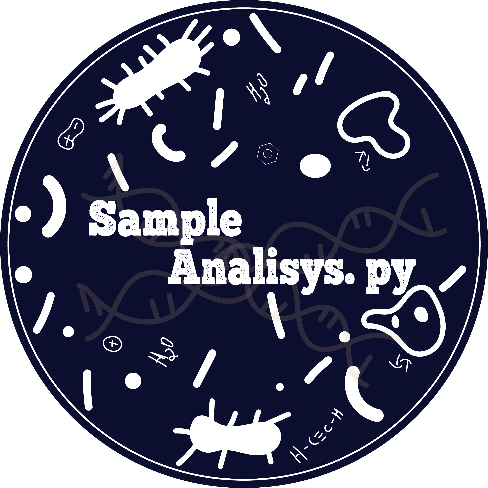
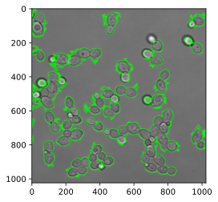
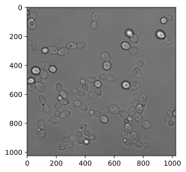

<h1 align="center">  Sample analisys – Cell Count</h1>

  

 :microscope: Cell counting using Python to identify, through images, the approximate amount of cells present in a sample :petri_dish: 

 
 This project consists of developing a tool capable of schematizing a count of living cells, distinguishing from dead cells present in animal tissue samples, from images collected from lab.

 

     

